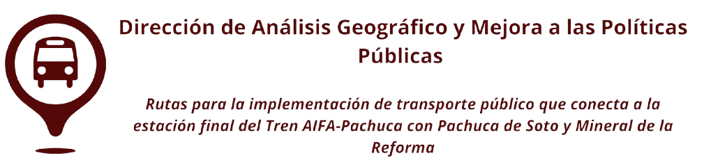
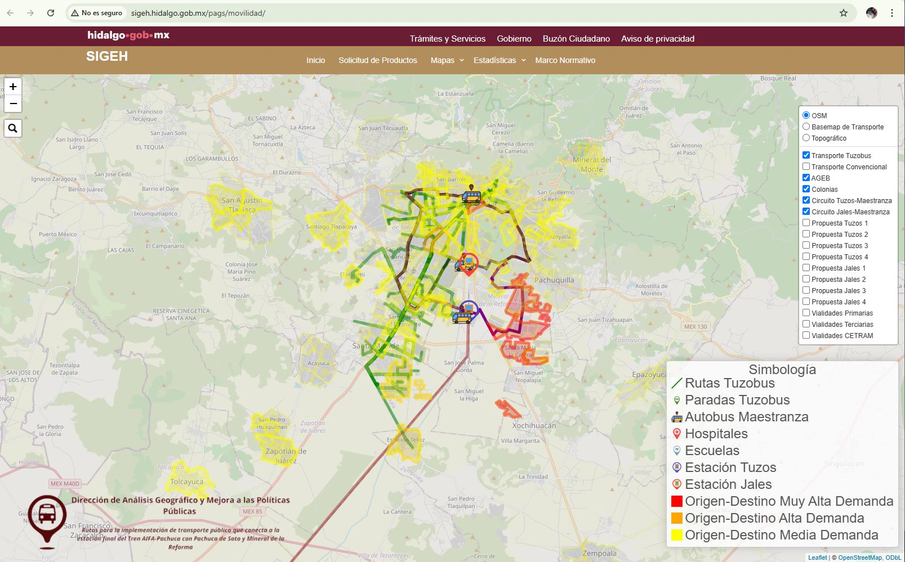
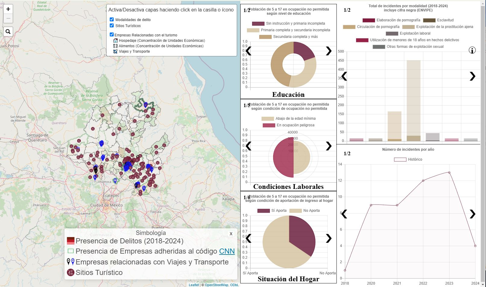

# Árbol de links. SIGEH
## Principales proyectos  

### Mapa Web Emisiones de Gases
Aquí iría una explicación de los tipos de gases o lo que podríamos encontrar en el mapa
[Emisiones de Gases](http://sigeh.hidalgo.gob.mx/pags/semarnath/)  

| Proyecto      | Vista previa                                 | Descripción |Enlace |
|--------------|-----------------------------------------------------------------------------------------------|--------------------|--------|
| **Proyecto 1** |  | Descripción A: En un lugar de la Mancha2, de cuyo nombre no quiero acordarme3, no ha mucho tiempo que vivía un hidalgo de los de lanza en astillero, adarga antigua, rocín flaco y galgo corredor4. Una olla de algo más vaca que carnero, salpicón las más noches5, duelos y quebrantos los sábados6, lantejas los viernes7, algún palomino de añadidura los domingos8, consumían las tres partes de su hacienda9.|[🔗 Ver más](https://ejemplo.com/proyecto1) |
| **Proyecto 2** |  | Descripción A|[🔗 Ver más](https://ejemplo.com/proyecto2) |
